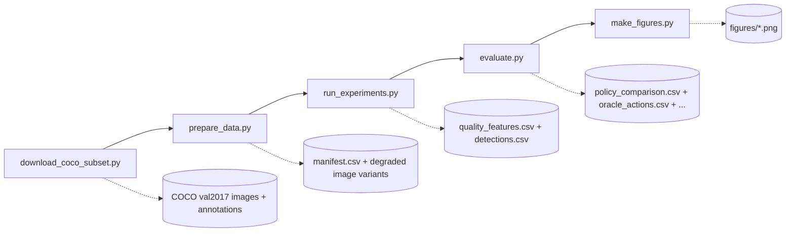

# Adaptive Preprocessing Routing for Object Detection under Image Degradations

> Input-dependent, automated selection of image enhancement actions for downstream machine perception — quantifying when preprocessing steps actively restore or systematically degrade detector performance.


[]()


**Paper status:** Submission — 2026 IEEE 3rd International Student Conference on Digital Generation (DG), 21–23 October 2026, Astana, Kazakhstan.

**Code status:** Full reproducible evaluation pipeline and Random Forest router training on 29,712 image variants.

---

| Author | Affiliation | ORCID |
| :--- | :--- | :--- |
| [**Alen Issayev**](https://www.linkedin.com/in/alen-issayev/) | School of Artificial Intelligence and Data Science, Astana IT University | [](https://orcid.org/0009-0006-5185-0250) |
| [**Gafur Khussanbayev**](https://www.linkedin.com/in/gafur-khussanbayev/) | School of Artificial Intelligence and Data Science, Astana IT University | [](https://orcid.org/0009-0004-7686-809X) |

---

## Table of Contents

- [1. Abstract & Core Research Questions](#1-abstract--core-research-questions)
- [2. Literature Context & Motivation](#2-literature-context--motivation)
- [3. Methodology & Theoretical Framework](#3-methodology--theoretical-framework)
- [4. Core Empirical Results & Analysis](#4-core-empirical-results--analysis)
- [5. Repository Architecture & Navigation](#5-repository-architecture--navigation)

---

## 1. Abstract & Core Research Questions

Object detectors are commonly evaluated on clean benchmark images, although deployed inputs may contain illumination loss, blur, noise, compression artifacts, and contrast degradation. This paper studies whether preprocessing should be selected adaptively for each image instead of applying one fixed enhancement method to all inputs. A Common Objects in Context validation subset of **4,952 retained images** is transformed into **29,712 image variants** across six controlled conditions. A pretrained YOLOv8n detector is evaluated without training or fine-tuning, while preprocessing policies choose among no processing, gamma correction, contrast-limited adaptive histogram equalization, and Retinex. Fixed enhancement policies are compared with a rule-based router, a Random Forest router, and an oracle policy that selects the best action offline. The Random Forest router reaches a mean detection score of **0.8398**, compared with **0.8071** for no preprocessing and **0.8504** for the oracle. It recovers most of the oracle improvement while reducing harmful preprocessing decisions to **3.16 percent**, compared with 12.14 percent for gamma correction, 17.50 percent for contrast-limited adaptive histogram equalization, and 27.98 percent for Retinex. The results show that adaptive preprocessing routing is a more reliable strategy than blind enhancement under controlled image degradations.

**Index Terms:** object detection; image degradation; adaptive preprocessing; image enhancement; routing policy; no-reference quality features

### Core Research Questions

**RQ1 (Perception vs. Aesthetics):** Does improving visual image quality directly correspond to an increase in downstream object detection performance, as measured by per-image recall at IoU 0.50?

**RQ2 (Blind vs. Adaptive Policy):** Can a lightweight machine learning router, operating solely on no-reference image-quality statistics and without access to a clean reference image or detector oracle, successfully identify when enhancement actions are safe or harmful on an image-by-image basis?

---

## 2. Literature Context & Motivation

Object detection systems are commonly evaluated on clean benchmark data, whereas deployed images may contain low illumination, sensor noise, blur, compression artifacts, and reduced contrast. These effects suppress object boundaries, alter texture statistics, shift detector confidence distributions, and increase missed detections. The COCO dataset is a standard object detection benchmark, but its clean validation split does not by itself characterize detector behavior under degraded input quality [1].

Robustness benchmarks establish that common corruptions and natural distribution shifts substantially reduce recognition and detection performance [2]–[4]. A practical response is to apply image preprocessing or enhancement before detection. However, enhancement is not guaranteed to improve downstream machine perception. Methods designed to improve visual appearance can amplify noise, change local contrast, distort object textures, or increase computational cost without improving detector output [5]–[7]. The critical observation motivating this work is that **perceptual image quality and downstream detection performance are not identical objectives.**

Classical enhancement methods such as CLAHE [9] and Retinex [10] can improve perceived contrast and illumination. Prior work indicates that distortions including blur, noise, exposure changes, and compression can produce detector failures, and that perceptual improvement does not always guarantee higher task accuracy [5, 7, 11]. The optimal preprocessing action is therefore condition-dependent: the same method that recovers detail under low-light JPEG compression can actively harm detection in already-clean or blur-degraded images by distorting the texture statistics on which the detector relies. Applying any single enhancement method unconditionally to all inputs is a blind policy that accumulates harmful decisions.

No-reference image quality assessment (NR-IQA) — including BRISQUE [12] and NIQE [13] — estimates quality without a clean reference image using natural-scene statistics. The present work adopts the same no-reference principle but reframes the objective: rather than predicting a perceptual quality score, the router uses no-reference features to select the preprocessing action most likely to improve or preserve detection score for that specific image.

The routing formulation is related to adaptive inference and conditional computation. SkipNet [14] and BlockDrop [15] learn input-dependent execution paths inside neural networks to reduce computation while preserving accuracy. The present work applies a structurally similar design pattern before the detector: an input-dependent policy selects preprocessing rather than skipping layers. The goal is not to replace the detector but to avoid applying enhancement when no preprocessing is the safer choice.

**Key empirical finding driving the motivation:**

> Fixed enhancement policies — including CLAHE and Retinex — consistently reduce mean object detection score across multiple degradation conditions. The harmful preprocessing rate of always-Retinex is **27.98%**, meaning more than one in four preprocessing decisions actively harm the detector relative to no preprocessing. Even the safest fixed policy, gamma correction, still harms **12.14%** of image-condition pairs while delivering only a marginal mean gain of +0.0017.

---

## 3. Methodology & Theoretical Framework

### Experimental Pipeline



### Experimental Protocol Summary

| Component | Setting |
| :--- | :--- |
| Dataset | COCO val2017 validation subset |
| Retained original images | 4,952 |
| Annotated objects | 36,781 |
| Generated image variants | 29,712 |
| Random seed | 42 |
| Detector | YOLOv8n pretrained on COCO |
| Detector settings | 640 px input, confidence 0.001, NMS IoU 0.7, max 300 detections |
| Detector training / fine-tuning | None |
| Image conditions | Clean, low-light, low-light + noise, low-light + JPEG, blur, contrast reduction |
| Preprocessing actions | None, gamma, CLAHE, Retinex |
| Compared policies | Fixed actions, rule-based router, Random Forest router, oracle |
| Policy primary score | Per-image recall at IoU 0.50 |
| Diagnostic figure metric | Condition-level mAP50–95 change vs. no preprocessing |

### No-Reference Feature Vector (14 statistics)

For each image-condition pair, 14 no-reference quality statistics are extracted using OpenCV without any clean reference image or detector feedback:

| # | Feature | Description |
| :---: | :--- | :--- |
| 1 | `mean_intensity` | Mean grayscale pixel intensity |
| 2 | `median_intensity` | Median grayscale pixel intensity |
| 3 | `dark_pixel_ratio` | Fraction of pixels with intensity < 50 |
| 4 | `rms_contrast` | Standard deviation of intensity (RMS contrast) |
| 5 | `histogram_spread` | CDF spread between the 5th and 95th percentiles |
| 6 | `laplacian_variance` | Variance of the Laplacian response (sharpness proxy) |
| 7 | `tenengrad` | Mean squared Sobel gradient magnitude (Tenengrad measure) |
| 8 | `edge_density` | Fraction of edge pixels from Canny (thresholds 80 / 160) |
| 9 | `gradient_magnitude` | Mean Sobel gradient magnitude |
| 10 | `noise_estimate` | High-frequency noise from Gaussian blur residual |
| 11 | `local_variance_estimate` | Mean local pixel variance in 5×5 neighbourhoods |
| 12 | `blockiness_proxy` | Mean absolute intensity difference across 8-pixel block boundaries |
| 13 | `saturation_mean` | Mean HSV saturation channel value |
| 14 | `saturation_std` | Standard deviation of the HSV saturation channel |

### Formal Evaluation Framework

Let $S(i, c, a)$ denote the primary policy score (per-image recall at IoU 0.50) for original image $i$, degradation condition $c$, and preprocessing action $a$. The action set is $\mathcal{A} = \{\text{none, gamma, CLAHE, Retinex}\}$.

**Oracle action** — hindsight-optimal action per image-condition pair (non-deployable upper bound):

$$a^*(i,c) = \arg\max_{a \in \mathcal{A}} \, S(i,c,a)$$

**Mean policy score** for a routing policy $\pi$ over $N$ image-condition pairs:

$$S_\pi = \frac{1}{N} \sum_{(i,c)} S\bigl(i,\, c,\, \pi(i,c)\bigr)$$

**Policy gain** over no preprocessing:

$$G_\pi = S_\pi - S_{\text{none}}$$

**Oracle gap**:

$$D_\pi = S_{\text{oracle}} - S_\pi$$

**Harmful preprocessing rate** — fraction of image-condition pairs where the policy scores strictly below no preprocessing:

$$H_\pi = \frac{1}{N} \sum_{(i,c)} \mathbb{1}\bigl[S(i,c,\pi(i,c)) < S(i,c,\text{none})\bigr]$$

---

## 4. Core Empirical Results & Analysis

### Figure 1 — Condition-Action Effect on Detection Score


*Each cell reports the change in condition-level mAP50–95 when a preprocessing action is applied relative to the no-preprocessing baseline (blue = improvement; orange = harm). Retinex degrades detection in every evaluated condition, with the largest drops under low-light + noise (−0.0711) and low-light + JPEG (−0.0631). CLAHE harms most conditions and is strongly negative under low-light + JPEG (−0.0424). Gamma correction is the only action with a positive aggregate effect, and this occurs mainly under low-light + JPEG (+0.0295); only a marginal improvement is seen under low-light + noise (+0.0016). No single fixed policy is safe across all conditions — this pattern directly motivates adaptive routing.*

### Figure 2 — Oracle vs. Random Forest Routing Distributions by Condition


*Stacked bars show the percentage of images assigned to each preprocessing action (None / Gamma / CLAHE / Retinex) by the oracle (O) and the Random Forest router (RF), broken down by degradation condition. Both the oracle and the learned router shift strongly toward gamma correction for low-light JPEG variants, where gamma is the only beneficial aggregate action. The Random Forest router captures this condition-dependent structure without access to oracle scores at inference time, explaining why it reduces harmful decisions to 3.16% while recovering approximately three-quarters of the available oracle gain.*

### Policy Comparison — Table II (29,712 Image-Condition Variants)

| Policy | Mean Score | Gain vs. None | Oracle Gap | Harmful Rate | Routing Accuracy | Runtime (ms) |
| :--- | :---: | :---: | :---: | :---: | :---: | :---: |
| Oracle *(non-deployable upper bound)* | **0.8504** | +0.0433 | 0.0000 | 0.00% | 100.00% | 139.36 |
| **Random Forest router** | **0.8398** | **+0.0327** | **0.0106** | **3.16%** | **83.68%** | 136.64 |
| Always gamma | 0.8088 | +0.0017 | 0.0416 | 12.14% | 35.91% | 47.58 |
| Always none *(baseline)* | 0.8071 | 0.0000 | 0.0433 | 0.00% | 28.54% | 48.11 |
| Always CLAHE | 0.7843 | −0.0228 | 0.0661 | 17.50% | 19.52% | 53.57 |
| Always Retinex | 0.7533 | −0.0539 | 0.0971 | 27.98% | 16.02% | 607.90 |
| Rule-based router | 0.6505 | −0.1566 | 0.1999 | 21.17% | 20.10% | 119.22 |

> The Random Forest router is the only deployable policy that simultaneously achieves a substantial positive gain (+0.0327), a low harmful-decision rate (3.16%), and a runtime competitive with single fixed-action policies (136.64 ms). Retinex is both the most harmful fixed policy (27.98%) and the most expensive (607.90 ms per image).

> **Runtime note.** All runtime values are within-run relative overhead measured in a single experimental run and are not hardware-normalized benchmark results; they should be compared only against each other. The oracle runtime (139.36 ms) is the runtime of the selected hindsight-best preprocessing action — it is not the cost of discovering the oracle, which requires offline access to detector scores for all candidate actions.

### Interpretation

The improvement delivered by the Random Forest router comes from correctly identifying when no preprocessing is the safer choice — not from unconditionally enhancing every image. The detector is unchanged throughout the experiment: the mean score increases from 0.8071 to 0.8398 purely through routing. Relative to the oracle improvement of 0.0433, the learned router recovers approximately three-quarters of the available gain (oracle gap = 0.0106). This result should be interpreted as a routing finding, not as evidence that enhancement universally improves detection.

---

## 5. Repository Architecture & Navigation

> 👉 For the complete step-by-step technical reproduction guide, directory layouts, dependency installations, and an exhaustive reference of all execution script CLI switches, jump directly to the interactive [Technical Reproduction Guide](docs/REPRODUCTION.md).

### Citation

```bibtex
@inproceedings{issayev2026adaptive,
  author    = {Issayev, Alen and Khussanbayev, Gafur},
  title     = {Adaptive Preprocessing Routing for Object Detection under Image Degradations},
  booktitle = {2026 IEEE 3rd International Student Conference on Digital Generation (DG)},
  year      = {2026},
  address   = {Astana, Kazakhstan},
  pages     = {(to appear)}
}
```

Machine-readable citation metadata is also available in [`CITATION.cff`](CITATION.cff).

### Acknowledgment

The authors thank A. Zhalgas for her careful review of the manuscript and constructive feedback on its organization, presentation, and clarity.

### License

Released under the [MIT License](LICENSE). Copyright © 2026 Alen Issayev, Gafur Khussanbayev.
