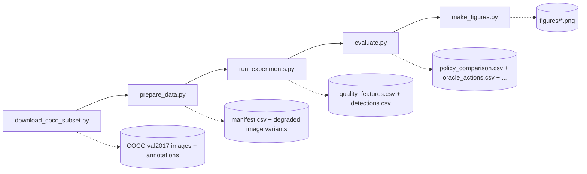

# Adaptive Preprocessing Routing for Object Detection under Image Degradations

> Input-dependent, automated selection of image enhancement actions for downstream machine perception — quantifying when preprocessing steps actively restore or systematically degrade detector performance.


[]()


**Paper status:** Accepted — 2026 IEEE 3rd International Student Conference on Digital Generation (DG), 21–23 October 2026, Astana, Kazakhstan. IEEE Xplore link will be added here once the paper is published.

**Code status:** Full reproducible evaluation pipeline and Random Forest router training on 29,712 image variants.

---

| Author | Affiliation | ORCID |
| :--- | :--- | :--- |
| [**Alen Issayev**](https://www.linkedin.com/in/alen-issayev/) | School of Artificial Intelligence and Data Science, Astana IT University | [](https://orcid.org/0009-0006-5185-0250) |
| [**Gafur Khussanbayev**](https://www.linkedin.com/in/gafur-khussanbayev/) | School of Artificial Intelligence and Data Science, Astana IT University | [](https://orcid.org/0009-0004-7686-809X) |

---

## Table of Contents

- [1. Overview](#1-overview)
- [2. How the Experiment Was Run](#2-how-the-experiment-was-run)
- [3. Headline Results](#3-headline-results)
- [4. Repository Structure & Reproduction](#4-repository-structure--reproduction)
- [5. Citation & Publication](#5-citation--publication)

---

## 1. Overview

Object detectors are usually evaluated on clean benchmark images, but real inputs can be dark, noisy, blurred, compressed, or low-contrast. Applying a single fixed enhancement method to every image is a common response, but enhancement is not guaranteed to help — it can just as easily distort textures or amplify noise and hurt the detector.

This repository studies whether an image-dependent **routing policy** can pick a preprocessing action per image instead. A pretrained YOLOv8n detector (no training or fine-tuning) is evaluated over a COCO validation subset under six controlled conditions, comparing fixed preprocessing, a rule-based router, a trained Random Forest router, and an offline oracle.

**RQ1 (Perception vs. Aesthetics):** Does improving visual image quality directly correspond to an increase in downstream object detection performance?

**RQ2 (Blind vs. Adaptive Policy):** Can a lightweight router, using only no-reference image-quality statistics (no clean reference, no detector oracle), decide when enhancement helps or hurts on a per-image basis?

For the full literature context, formal problem definition, and discussion, see the paper (citation below).

---

## 2. How the Experiment Was Run

The pipeline has five stages, each a standalone script under [`scripts/`](scripts/):


```mermaid
flowchart LR
    A[download_coco_subset.py] --> B[prepare_data.py]
    B --> C[run_experiments.py]
    C --> D[evaluate.py]
    D --> E[make_figures.py]

    A -.-> A1[(COCO val2017 images + annotations)]
    B -.-> B1[(manifest.csv + degraded image variants)]
    C -.-> C1[(quality_features.csv + detections.csv)]
    D -.-> D1[(policy_comparison.csv + oracle_actions.csv + ...)]
    E -.-> E1[(figures/*.png)]
```

1. **Acquire data** — download a COCO val2017 subset and its annotations.
2. **Synthesize degradations** — each retained image is rendered into 6 conditions (clean, low-light, low-light + noise, low-light + JPEG, blur, contrast reduction), producing the manifest of image variants that every later stage reads from. Exact degradation parameters (noise level, JPEG quality, blur kernel, etc.) live in [`configs/experiment.yaml`](configs/experiment.yaml).
3. **Extract features and run the detector** — for every image variant, 14 no-reference quality statistics are computed with OpenCV (intensity, contrast, sharpness, edge density, noise, blockiness, saturation, ...), and YOLOv8n is run once per preprocessing action (none, gamma, CLAHE, Retinex) at a fixed inference configuration.
4. **Evaluate policies and train the router** — per-image recall at IoU 0.50 is used as the primary score. The oracle label per image-condition pair is the action that scores highest; a Random Forest classifier is trained (grouped train/test split) to predict that label from the no-reference features alone, without ever seeing detector output at inference time. Fixed policies, a manually-thresholded rule-based router, the Random Forest router, and the oracle are then all scored on the same primary metric, plus policy gain, oracle gap, harmful-preprocessing rate, routing accuracy, and per-image runtime.
5. **Render diagnostic figures** — supplementary plots summarizing the metrics above.

Everything downstream of stage 1 is deterministic given the fixed random seed (42). The exact CLI flags, config schema, directory layout, and expected outputs for each stage are documented in the [Technical Reproduction Guide](docs/REPRODUCTION.md) — this section only summarizes what happens, not how to invoke it.

---

## 3. Headline Results

Evaluated over 29,712 image-condition variants:

| Policy | Mean Score | Gain vs. None | Oracle Gap | Harmful Rate | Routing Accuracy | Runtime (ms) |
| :--- | :---: | :---: | :---: | :---: | :---: | :---: |
| Oracle *(non-deployable upper bound)* | **0.8504** | +0.0433 | 0.0000 | 0.00% | 100.00% | 139.36 |
| **Random Forest router** | **0.8398** | **+0.0327** | **0.0106** | **3.16%** | **83.68%** | 136.64 |
| Always gamma | 0.8088 | +0.0017 | 0.0416 | 12.14% | 35.91% | 47.58 |
| Always none *(baseline)* | 0.8071 | 0.0000 | 0.0433 | 0.00% | 28.54% | 48.11 |
| Always CLAHE | 0.7843 | −0.0228 | 0.0661 | 17.50% | 19.52% | 53.57 |
| Always Retinex | 0.7533 | −0.0539 | 0.0971 | 27.98% | 16.02% | 607.90 |
| Rule-based router | 0.6505 | −0.1566 | 0.1999 | 21.17% | 20.10% | 119.22 |

No fixed action is safe across all conditions — CLAHE and Retinex reduce the mean score relative to doing nothing, and even the best fixed action (gamma) still harms 12% of cases. The Random Forest router recovers most of the oracle's gain (0.0327 of 0.0433 available) while cutting harmful decisions to 3.16%, using only no-reference image statistics and no access to detector output at inference time.

Full tables, per-condition breakdowns, and figures are generated by the pipeline into `results/tables/` and `results/figures/` — see [§4](#4-repository-structure--reproduction) to reproduce them locally.

---

## 4. Repository Structure & Reproduction

> For the complete step-by-step technical reproduction guide, directory layouts, dependency installation, and an exhaustive reference of every script's CLI flags, see the [Technical Reproduction Guide](docs/REPRODUCTION.md).

Top-level layout:

```text
enhancement-routing-detection/
├── configs/experiment.yaml   ← single source of truth for all pipeline parameters
├── src/enhancement_routing/  ← degradation synthesis, feature extraction, metrics, plotting
├── scripts/                  ← the 5 pipeline stages (see §2)
├── results/                  ← generated tables, figures, and the serialized router (gitignored)
└── docs/REPRODUCTION.md      ← full reproduction guide
```

---

## 5. Citation & Publication

**Conference paper:** *2026 IEEE 3rd International Student Conference on Digital Generation (DG)*, 21–23 October 2026, Astana, Kazakhstan. The IEEE Xplore link and DOI will be added here once assigned.

```bibtex
@inproceedings{issayev2026adaptive,
  author    = {Issayev, Alen and Khussanbayev, Gafur},
  title     = {Adaptive Preprocessing Routing for Object Detection under Image Degradations},
  booktitle = {2026 IEEE 3rd International Student Conference on Digital Generation (DG)},
  year      = {2026},
  address   = {Astana, Kazakhstan},
  pages     = {(to appear)}
}
```

Machine-readable citation metadata for citing this repository/code is also available in [`CITATION.cff`](CITATION.cff).

### Acknowledgment

The authors thank A. Zhalgas for her careful review of the manuscript and constructive feedback on its organization, presentation, and clarity.

### License

Released under the [MIT License](LICENSE). Copyright © 2026 Alen Issayev, Gafur Khussanbayev.
